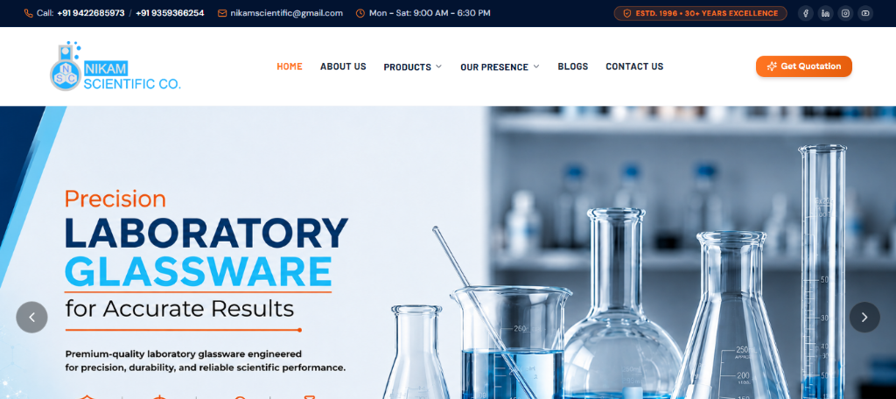
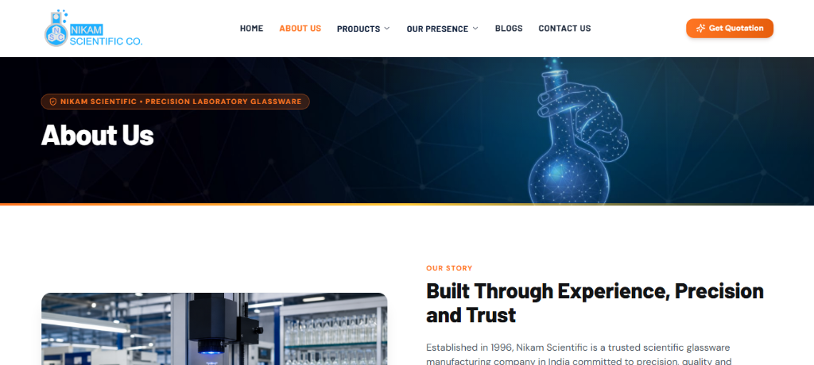
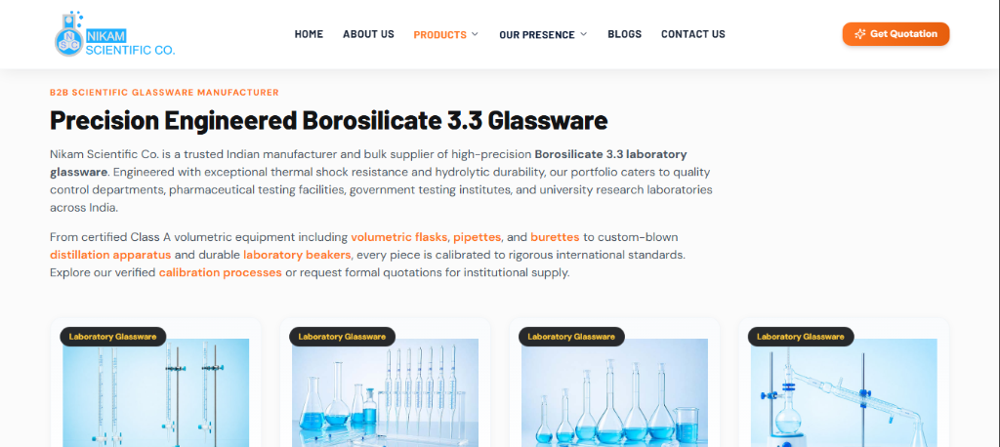
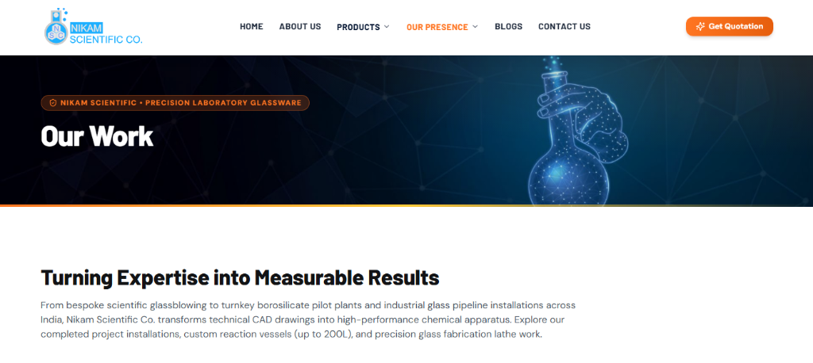

# Nikam Scientific Co. — Official Enterprise Web Platform & E-Catalog

<div align="center">

[](https://nextjs.org/)
[](https://reactjs.org/)
[](https://www.typescriptlang.org/)
[](https://tailwindcss.com/)
[](https://expressjs.com/)
[](https://developers.google.com/search)

**High-performance, B2B scientific glassware manufacturer website and digital product catalog for Nikam Scientific Co. (Established 1996, Boisar, Maharashtra, India). Built with Next.js 14 App Router, Express, TypeScript, Tailwind CSS, Nodemailer, and comprehensive Pan-India SEO.**

</div>

---

## 📸 Platform Showcase

<div align="center">
  <table border="0" cellpadding="0" cellspacing="6" width="100%">
    <tr>
      <td width="50%" align="center" valign="top">
        
        <br />
        <sub><b>Home Page &amp; Hero Banner Showcase</b></sub>
      </td>
      <td width="50%" align="center" valign="top">
        
        <br />
        <sub><b>About Us &amp; 30+ Years Manufacturing Heritage</b></sub>
      </td>
    </tr>
    <tr>
      <td width="50%" align="center" valign="top">
        
        <br />
        <sub><b>Laboratory Glassware Catalog &amp; Divisions</b></sub>
      </td>
      <td width="50%" align="center" valign="top">
        
        <br />
        <sub><b>Our Work, Turnkey Projects &amp; Manufacturing Videos</b></sub>
      </td>
    </tr>
  </table>
</div>

---

## 🌟 Executive Overview

**Nikam Scientific Co.** is one of India's premier scientific glassware and laboratory equipment manufacturers, serving pharmaceutical giants, chemical processing plants, research institutions, and universities nationwide since 1996.

This modern web platform replaces legacy WordPress setups with an ultra-fast, server-rendered **Next.js 14 App Router** architecture backed by a **Node.js + Express backend server**. It features an interactive RFQ (Request-for-Quote) engine, viewport-sticky product exploration UX, and end-to-end B2B SEO architecture tailored for Google AI Overviews and top organic search rankings.

---

## ⚡ Key Highlights & Features

- **Next.js 14 App Router**: Hybrid Server-Side Rendering (SSR), Static Generation (SSG), and responsive client components.
- **Custom Express Backend Server**: Combined Next.js handler and high-throughput Express REST endpoints with built-in CORS, Nodemailer, and legacy URL rewrites.
- **Multi-Recipient Email Notification System**:
  - Automatically dispatches **3 branded HTML emails** in parallel per inquiry:
    1. **Customer Confirmation**: Auto-acknowledgment email with complete quote details and 3–4 hour response expectation.
    2. **Website Owner Alert**: Detailed lead dossier to `info@nikamscientific.com` with 1-click **Reply** and **Call** links.
    3. **Technical Team Notification**: Operational notification copy to `integralwebsolution@gmail.com`.
- **Synchronized Viewport-Sticky Product UX**:
  - The left product image card remains dynamically pinned in the viewport while users scroll through extensive technical specifications, applications, and manufacturing notes on the right column.
- **Strict Aspect-Ratio Video Showcase**:
  - All manufacturing and glassblowing lathe videos on the *Our Work* page maintain an exact 16:9 widescreen layout with uniform card heights and zero empty space.
- **Interactive RFQ & Quote Modal**:
  - Context-aware quote modal pre-populated with product name, instant validation, and instant feedback.
- **Enterprise Design System**:
  - Built with Tailwind CSS, custom design tokens, Lucide icons, Google Fonts (`DM Sans`, `Barlow`, `Montserrat`), and authentic laboratory photography.

---

## 🔍 Comprehensive SEO Architecture

Engineered to senior SEO executive standards to achieve top rankings across India for competitive B2B laboratory glassware keywords and ensure citation in **Google AI Overviews (SGE)**.

### 1. Keyword Strategy & Hierarchy
Every single page incorporates a defined **Focus Keyword** combined with high-volume, medium-volume, and long-tail supportive keywords:
- **Core Pages (6 Pages)**:
  - **Home (`/`)**: *Laboratory Glassware Manufacturer in India* (Supportive: *borosilicate laboratory glassware, lab equipment suppliers, custom glassblowing lathe Boisar*).
  - **About Us (`/about-us`)**: *About Nikam Scientific Co.* (Supportive: *scientific glassware manufacturer history, ISO 9001 certified lab glassware Boisar*).
  - **Our Clients (`/our-clients`)**: *Nikam Scientific Clients & Partners* (Supportive: *pharma lab glassware supply, industrial chemical laboratory clients*).
  - **Our Work (`/our-work`)**: *Turnkey Laboratory Glassware Projects* (Supportive: *custom glass distillation rig fabrication, pilot plant process glass assembly*).
  - **Blogs (`/blogs`)**: *Scientific Glassware Insights & Technical Guides* (Supportive: *volumetric calibration Class A vs B, cleaning borosilicate glassware*).
  - **Contact Us (`/contact-us`)**: *Contact Nikam Scientific Co.* (Supportive: *glassware manufacturer phone number, request quotation laboratory apparatus Boisar*).
- **Category Hubs (3 Pages)**:
  - `/laboratory-glassware`: *Borosilicate 3.3 Laboratory Glassware Manufacturer*
  - `/laboratory-equipments`: *Precision Laboratory Equipment Manufacturer & Supplier*
  - `/industrial-processing-unit`: *Industrial Glass Process Plant & Reaction Unit Manufacturer*
- **Product Detail Catalog (28 Dedicated Pages)**:
  - Focus and supportive keyword targeting on every product: Burettes, Pipettes, Volumetric Flasks, Condensers, Joint Adapters, Sintered Glassware, Reaction Vessels, BOD Incubators, Autoclaves, Sight Glasses, etc.

### 2. Schema.org JSON-LD Structured Data
Implemented across all 37 pages to maximize rich results in Google Search:
- **`Organization` & `LocalBusiness`**: Injected globally via `JsonLd.tsx` with verified address, telephone, logo, geographic coordinates, and sameAs profiles.
- **`BreadcrumbList`**: Dynamic breadcrumb trail on all categories and product subpaths.
- **`Product` & `Offer`**: Complete product metadata including name, description, SKU, MPN, brand (*Nikam Scientific*), and `ItemAvailability` (*https://schema.org/InStock*).
- **`FAQPage`**: 4 custom, search-optimized Q&A pairs per product (totaling over 120+ structured FAQs) providing structured question-answer pairs for Google SERP expandable accordions.

### 3. Technical SEO Assets
- **Dynamic XML Sitemap (`/sitemap.xml`)**: Auto-generated via `src/app/sitemap.ts` listing all 37 canonical URLs with priority and change frequencies.
- **Robots.txt (`/robots.txt`)**: Managed by `src/app/robots.ts` with explicit crawler directives for GoogleBot and reference to the sitemap.
- **OpenGraph & Twitter Cards**: High-resolution preview banners, canonical tags, and mobile-friendly viewport meta tags.
- **Modern Favicons**: Multi-resolution `favicon.ico`, `favicon2-16x16.png`, `favicon2-32x32.png`, `favicon2.png` (192px), and `apple-touch-icon.png` (180px).

---

## 📁 Project Structure

```
antigravity/
├── docs/
│   └── images/                     # Platform preview screenshots for README
│       ├── home-page.png
│       ├── about-page.png
│       ├── products-page.png
│       └── our-work-page.png
├── public/                         # Static public assets & favicons
│   ├── demo-2/images/              # Authentic banners, hero photography, logos
│   ├── favicon.ico                 # Multi-resolution ICO (16x16, 32x32, 48x48)
│   ├── favicon2-16x16.png          # 16px PNG favicon
│   ├── favicon2-32x32.png          # 32px PNG favicon
│   ├── favicon2.png                # 192px High-res icon
│   └── apple-touch-icon.png        # 180px iOS Touch Icon
├── server/
│   └── index.ts                    # Custom Express server + Nodemailer API + Next.js bridge
├── src/
│   ├── app/
│   │   ├── api/contact/route.ts    # Next.js API fallback route for contact
│   │   ├── about-us/page.tsx       # About Us page
│   │   ├── blogs/                  # Blog listing & [slug] dynamic articles
│   │   ├── contact-us/page.tsx     # Contact & RFQ page
│   │   ├── industrial-processing-unit/page.tsx # Industrial Processing Category Hub
│   │   ├── laboratory-equipments/page.tsx     # Laboratory Equipments Category Hub
│   │   ├── laboratory-glassware/page.tsx      # Laboratory Glassware Category Hub
│   │   ├── our-clients/page.tsx    # Client trust & partners page
│   │   ├── our-work/page.tsx       # Completed project galleries & 16:9 video showcase
│   │   ├── products/[slug]/        # 28 Dynamic product pages with sticky image layout
│   │   ├── globals.css             # Global CSS, theme variables, sticky utilities
│   │   ├── layout.tsx              # Root HTML layout, SEO JSON-LD & metadata
│   │   ├── page.tsx                # Homepage composition
│   │   ├── robots.ts               # Dynamic /robots.txt
│   │   └── sitemap.ts              # Dynamic /sitemap.xml (37 pages indexed)
│   ├── components/
│   │   ├── forms/                  # ContactForm, QuoteModal, Modal Context
│   │   ├── home/                   # HeroBanner, FeaturePillars, WhyChooseUs, etc.
│   │   ├── layout/                 # TopBar, Header, Footer, MobileMenu
│   │   ├── seo/                    # JsonLd component, ProductFaqSection
│   │   └── ui/                     # Breadcrumb, ProductCard, buttons
│   ├── data/
│   │   ├── company.ts              # Verified address, phone numbers, hours, socials
│   │   ├── corePagesSeo.ts         # Core pages SEO keywords, schemas, metadata
│   │   ├── live_product_content.json # Authentic live product insights & paragraphs
│   │   ├── navigation.ts           # Navbar links & dropdown hierarchy
│   │   ├── productSeoData.ts       # 28 Product SEO focus keywords, titles, FAQs
│   │   └── products.ts             # 28 Products catalog definitions, specs & features
│   └── lib/
│       ├── mailer.ts               # Nodemailer 3-recipient parallel email pipeline & HTML templates
│       └── utils.ts                # Utility helpers & class merger
├── .env.example                    # Template environment configuration
├── .env.local                      # Local environment secrets (SMTP credentials)
├── next.config.mjs                 # Next.js build & image domains config
├── package.json                    # Project dependencies & scripts
├── tailwind.config.ts              # Tailwind CSS theme extensions & typography
└── tsconfig.json                   # TypeScript compiler configuration
```

---

## 🛠️ Tech Stack & Dependencies

| Layer | Technologies |
|---|---|
| **Frontend Framework** | [Next.js 14 (App Router)](https://nextjs.org/) &amp; [React 18](https://reactjs.org/) |
| **Language** | [TypeScript 5.6](https://www.typescriptlang.org/) |
| **Styling &amp; UI** | [Tailwind CSS 3.4](https://tailwindcss.com/), PostCSS, Autoprefixer |
| **Icons &amp; Fonts** | [Lucide React](https://lucide.dev/), Google Fonts (`DM Sans`, `Barlow`, `Montserrat`) |
| **Custom Backend Server**| [Express 4.21](https://expressjs.com/), [tsx](https://github.com/privatenumber/tsx), Node.js |
| **Email Transport** | [Nodemailer 6.9](https://nodemailer.com/) with parallel `Promise.allSettled` |
| **Image Processing** | [Sharp 0.35](https://sharp.pixelplumbing.com/) &amp; `next/image` |
| **Configuration** | [dotenv](https://www.npmjs.com/package/dotenv), [cors](https://www.npmjs.com/package/cors) |

---

## 📦 Getting Started & Local Setup

### 1. Prerequisites
- **Node.js**: v18.17.0 or newer (v20+ recommended)
- **npm**: v9.0.0 or newer

### 2. Installation
Clone or navigate to the repository directory and install dependencies:
```bash
git clone https://github.com/your-username/nikam-scientific.git
cd nikam-scientific
npm install
```

### 3. Configure Environment Variables
Copy the template `.env.example` to `.env.local`:
```bash
cp .env.example .env.local
```

Open `.env.local` and configure your SMTP credentials:
```env
PORT=3000
NODE_ENV=development

# Gmail SMTP Configuration
SMTP_HOST=smtp.gmail.com
SMTP_PORT=587
SMTP_SECURE=false

# Authenticated account for sending
SMTP_USER=integralwebsolution@gmail.com

# 16-character Google App Password
SMTP_PASS=your_16_character_app_password_here

# Sender header displayed to recipients
SMTP_FROM="Nikam Scientific Co." <integralwebsolution@gmail.com>

# Lead Alert Recipients
OWNER_EMAIL=info@nikamscientific.com
ADMIN_NOTIFY_EMAIL=integralwebsolution@gmail.com
```

> **Note**: To generate a Google App Password for `integralwebsolution@gmail.com`:
> 1. Go to [Google Account Security](https://myaccount.google.com/security).
> 2. Ensure **2-Step Verification** is enabled.
> 3. Search for **App passwords**, create an entry named `Nikam Website`, and paste the 16-character key into `SMTP_PASS`.

### 4. Running the Development Server
Start the unified Node.js + Express + Next.js server:
```bash
npm run dev
```
The application will be live at **`http://localhost:3000`**.

---

## 🚀 Production Build & Deployment

### Build the Application
```bash
npm run build
```

### Start Production Server
```bash
npm run start
```
The custom Express server boots Next.js in production mode, serving pre-rendered assets, handling API requests, and listening on the configured `PORT` (default: `3000`).

---

## 📑 Product Catalog Routing Matrix (28 Products)

| Category | Product Name | Slug Route | Legacy WordPress URL |
|---|---|---|---|
| **Laboratory Glassware** | Burettes | `/products/burettes` | `/burettes` |
| **Laboratory Glassware** | Pipettes | `/products/pipettes` | `/pipettes` |
| **Laboratory Glassware** | Measuring Volumetric Flasks | `/products/measuring-volumetric-flasks` | `/measuring-volumetric-flasks` |
| **Laboratory Glassware** | Tubes &amp; Test Tubes | `/products/tube` | `/tube` |
| **Laboratory Glassware** | Distillation Condensers | `/products/distillation-apparatus-parts-condensers` | `/distillation-apparatus-parts-condensers` |
| **Laboratory Glassware** | Standard Joints &amp; Adapters | `/products/standard-joints-stoppers-adapters` | `/standard-joints-stoppers-adapters` |
| **Laboratory Glassware** | Boiling &amp; Erlenmeyer Flasks| `/products/flasks` | `/flasks` |
| **Laboratory Glassware** | Still Heads &amp; Splash Heads | `/products/still-heads-splash-heads` | `/still-heads-splash-heads` |
| **Laboratory Glassware** | Miscellaneous Fittings | `/products/miscellaneous-fitting` | `/miscellaneous-fitting` |
| **Laboratory Glassware** | Glass Stirrers | `/products/stirrers` | `/stirrers` |
| **Laboratory Glassware** | Separating &amp; Dropping Funnels| `/products/separating-dropping-funnels` | `/separating-dropping-funnels` |
| **Laboratory Glassware** | Fractionating Columns | `/products/fractionating-columns` | `/fractionating-columns` |
| **Laboratory Glassware** | Distillation Apparatus | `/products/distillation-apparatus` | `/distillation-apparatus` |
| **Laboratory Glassware** | Chromatography Apparatus | `/products/chromatography-apparatus` | `/chromatography-apparatus` |
| **Laboratory Glassware** | Beakers | `/products/beakers` | `/beakers` |
| **Laboratory Glassware** | Reagent Bottles | `/products/bottles` | `/bottles` |
| **Laboratory Glassware** | Gas Apparatus | `/products/gas-apparatus` | `/gas-apparatus` |
| **Laboratory Glassware** | Custom Laboratory Apparatus| `/products/miscellaneous-apparatus` | `/miscellaneous-apparatus` |
| **Laboratory Equipment** | Laboratory Ovens | `/products/laboratory-ovens` | `/laboratory-ovens` |
| **Laboratory Equipment** | Lab Water Bath | `/products/lab-water-bath` | `/lab-water-bath` |
| **Laboratory Equipment** | BOD Incubator | `/products/bod-incubator` | `/bod-incubator` |
| **Laboratory Equipment** | Autoclave | `/products/autoclave` | `/autoclave` |
| **Industrial Processing** | Pipeline Components | `/products/pipeline-components` | `/pipeline-components` |
| **Industrial Processing** | Industrial Reaction Vessels | `/products/vessels` | `/vessels` |
| **Industrial Processing** | Industrial Stirrers | `/products/stirrers-2` | `/stirrers-2` |
| **Industrial Processing** | Glass Heat Exchangers | `/products/heat-exchangers` | `/heat-exchangers` |
| **Industrial Processing** | Column Components | `/products/column-components` | `/column-components` |
| **Industrial Processing** | Sight Glass | `/products/sight-glass` | `/sight-glass` |

---

## 🏢 Company Information & Contacts

- **Company Name**: Nikam Scientific Co.
- **Established**: 1996 (30+ Years of Manufacturing Excellence)
- **Manufacturing Plant &amp; Office**:
  Unit No - 18, 19 &amp; 20, Jay Ambe Nagar, Shivaji Nagar, Dist. Palghar, Salvad - 401 504, Boisar (W), Maharashtra, India.
- **Sales &amp; Engineering Desk**: +91 9422685973 / +91 9359366254
- **Official Email**: `info@nikamscientific.com` / `nikamscientific@gmail.com`
- **Website**: [https://nikamscientific.com](https://nikamscientific.com)

---

## 📄 License & Attribution

&copy; 1996 - 2026 **Nikam Scientific Co.** All Rights Reserved.  
Web Platform developed &amp; maintained in partnership with **Soham Aeer**.
